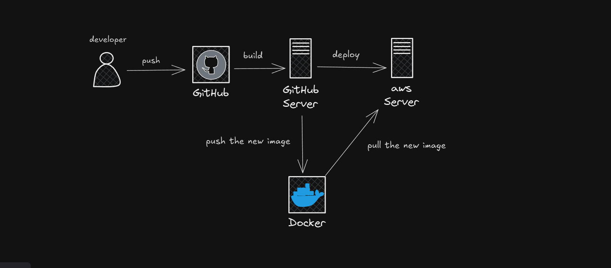

# MyBank - Backend API

  
*A robust banking API built with Symfony PHP framework*

## Table of Contents
- [MyBank - Backend API](#mybank---backend-api)
  - [Table of Contents](#table-of-contents)
  - [Project Overview](#project-overview)
  - [API Features](#api-features)
  - [Technology Stack](#technology-stack)
  - [Project Structure](#project-structure)
  - [Installation](#installation)
  - [Development Setup](#development-setup)
  - [Database Migrations](#database-migrations)
  - [API Documentation](#api-documentation)
  - [Testing -- *peding*](#testing----peding)
  - [Deployment](#deployment)
    - [Docker](#docker)
    - [Production Requirements](#production-requirements)
  - [CI/CD](#cicd)
  - [CI/CD process](#cicd-process)

## Project Overview
The MyBank backend provides secure RESTful APIs for the banking platform, handling user authentication, account management, and transaction processing with Symfony's robust framework.

## API Features
- 🔒 JWT Authentication
- 🏦 Account management endpoints
- 💰 Transaction processing
- 📈 Financial data aggregation
- 🔍 Entity repositories with Doctrine
- 🛡️ CSRF protection
- 📄 API documentation
- 📦 Docker container support

## Technology Stack
| Component         | Technology                          |
|-------------------|-------------------------------------|
| Framework         | Symfony 6                           |
| Database          | Doctrine ORM                        |
| Authentication    | JWT (LexikJWTAuthenticationBundle)  |
| Serialization     | API Platform                        |
| Validation        | Symfony Validator                   |
| Caching           | Symfony Cache                       |
| Testing           | PHPUnit                             |
| Deployment        | Docker, Nginx                       |
| CI/CD             | GitHub Actions                      |

## Project Structure
```
backend/
├── config/               # Configuration files
│   ├── packages/         # Service configurations
│   ├── routes.yaml       # Routing configuration
│   └── services.yaml     # Service definitions
├── migrations/           # Database migrations
├── public/               # Web server root
│   └── index.php         # Front controller
├── src/
│   ├── Controller/       # API controllers
│   ├── Entity/           # Doctrine entities
│   ├── Repository/       # Custom repositories
│   ├── Service/          # Business logic
│   └── Kernel.php        # Application kernel
├── templates/            # Twig templates (if applicable)
├── var/                  # Cache and logs
├── vendor/               # Composer dependencies
├── .env                  # Environment variables
├── Dockerfile            # Container configuration
├── entrypoint.sh         # Container entry script
└── composer.json         # PHP dependencies
```

## Installation
1. **Clone repository**
   ```bash
   git clone https://github.com/yourusername/mybank-backend.git
   cd mybank-backend
   ```

2. **Install dependencies**
   ```bash
   composer install
   ```

3. **Configure environment**
   ```bash
   cp .env .env.local
   # Update database and JWT configuration
   ```

## Development Setup
1. **Start development server**
   ```bash
   symfony server:start
   ```

2. **Generate JWT keys**
   ```bash
   openssl genpkey -out config/jwt/private.pem -aes256 -algorithm rsa -pkeyopt rsa_keygen_bits:4096
   openssl pkey -in config/jwt/private.pem -out config/jwt/public.pem -pubout
   ```

## Database Migrations
1. **Create new migration**
   ```bash
   php bin/console make:migration
   ```

2. **Execute migrations**
   ```bash
   php bin/console doctrine:migrations:migrate
   ```

## API Documentation
Access the API documentation at:  
`http://localhost:8000/`


## Testing -- *peding*
Run PHPUnit tests:
```bash
php bin/phpunit
```

## Deployment
### Docker
```bash
docker-compose build
docker-compose up -d
```

### Production Requirements
- PHP 8.1+
- MySQL 5.7+

## CI/CD
GitHub Actions workflow (`/.github/workflows/main.yml`) includes:
- PHP linting
- build tests
- Docker image building
## CI/CD process

